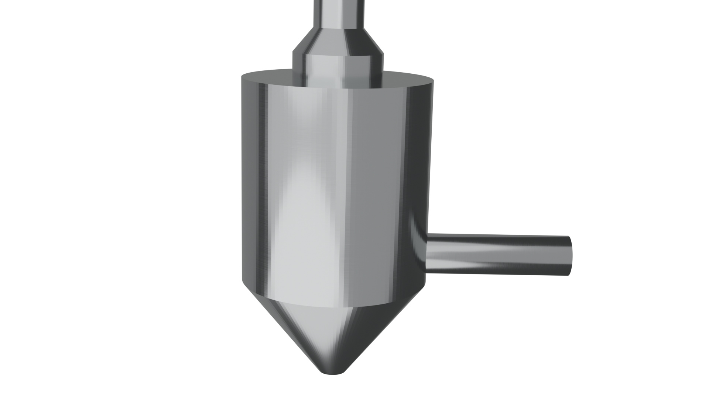

<!-- PROJECT LOGO -->
 

  
       
    <h1 align="center">Spray Dryer</h3>
    <h4 align="center">Mathematical modeling of a spray dryer in matlab and OpenFoam (only flow-dynamic), modified from https://super.chem.polimi.it/ script, detailed informations in pdf folder.</h4>

## 1-D model
Simulation details [Matlab-new](./spray_matlab.m):
- non-dimensional numbers calculated inside the integral function;
- constrained evaluation of mass and particle diameter;
- weighted evaluation of density;

Simulation details [Matlab-corrected](./spray_dryer_corr):
- non-dimensional numbers calculated inside the integral function;
- constrained evaluation of mass and particle diameter;
- weighted evaluation of density;
- surface confined axial jet correlation from [Hydraulic characteristics of turbulent circular jets under surface confinement](https://doi.org/10.1080/09715010.2013.876725)
## 3D-model
Simulation details [RAS](./spray_RAS):
- 2Mln mesh cells;
- k-omega-SST RAS model;
- inlet Q=20Kg/s;
- outlet Pout = 0;

Simulation details [RAS + DPFoam](./spray_part):
- 2Mln mesh cells;
- k-omega-SST RAS model;
- inlet Q=20Kg/s;
- outlet Pout = 0;
- 8000 particles;
- Drag Force + gravity + boundaries rebound/escape;

# Results:
- plot [Matlab-new](./spray_matlab.m):

- plot [Matlab-corrected](./spray_dryer_corrected) for D-ratio = 1.5

- 3D flow in OpenFoam:

https://user-images.githubusercontent.com/120776791/208930344-1c460252-828a-4064-b2e2-bc88c6fd3eec.mp4

https://user-images.githubusercontent.com/120776791/208931821-2a182562-6b0d-4896-b570-e6eeabedb428.mp4

- matrix particle plot

- mesh

